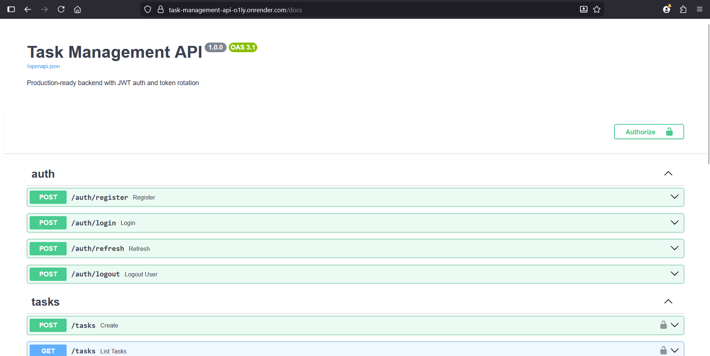
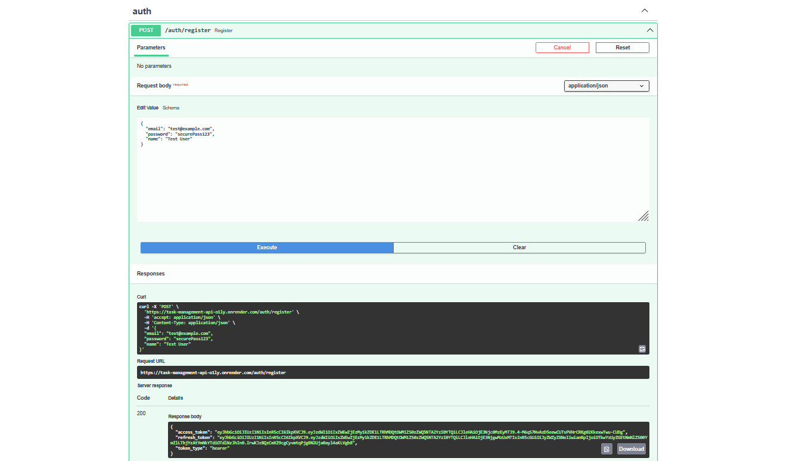
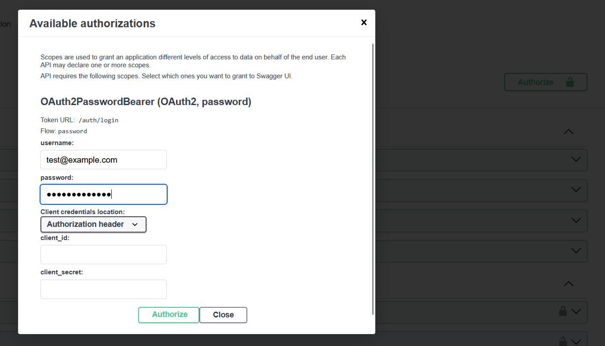
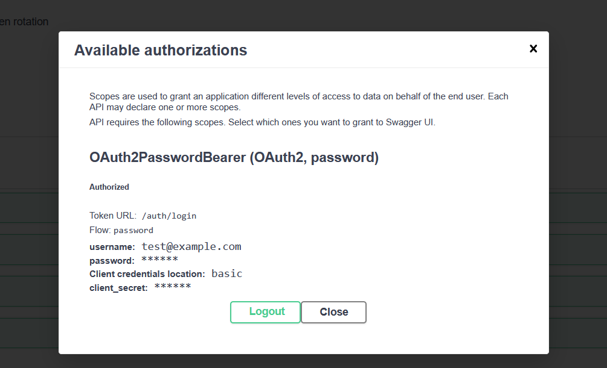
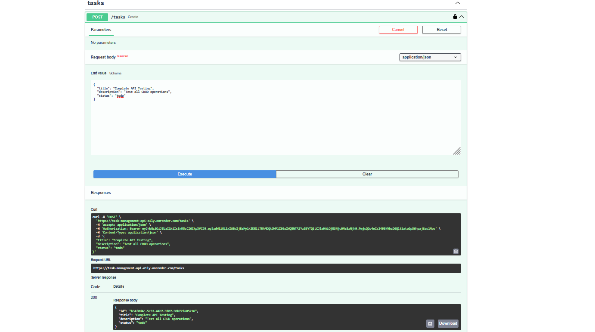
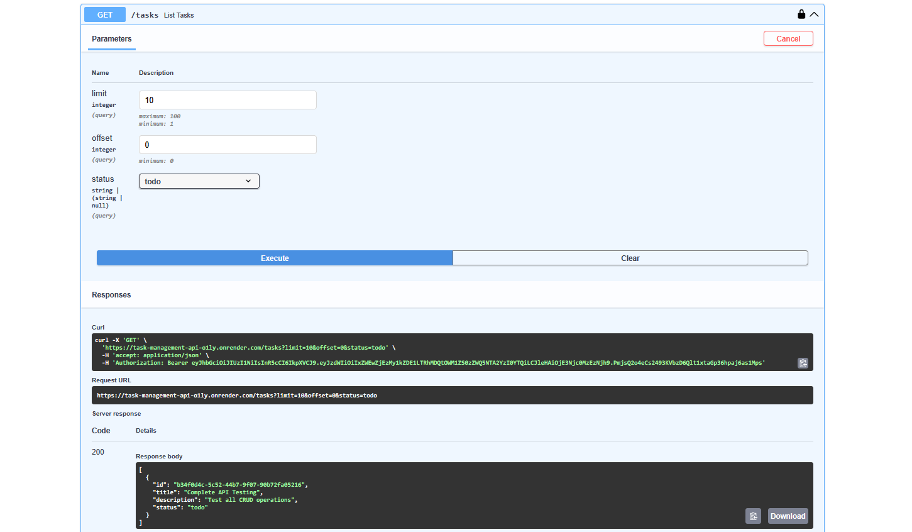
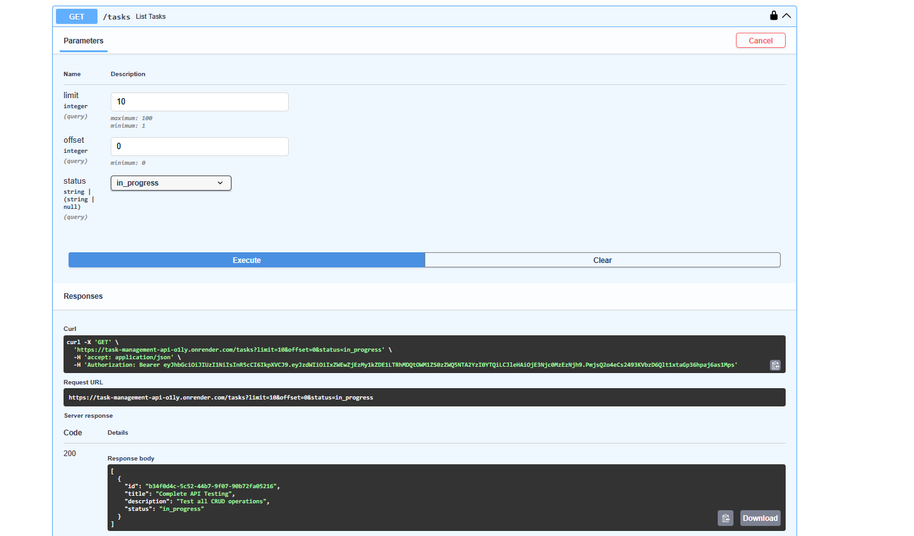
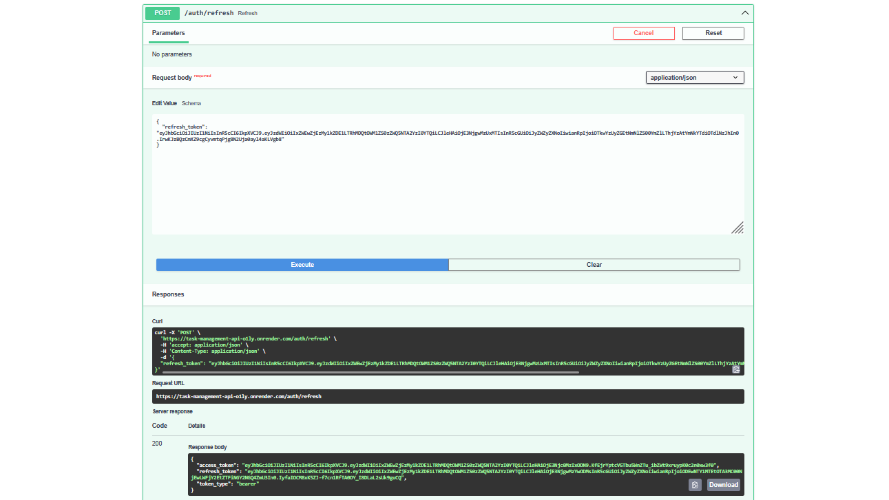
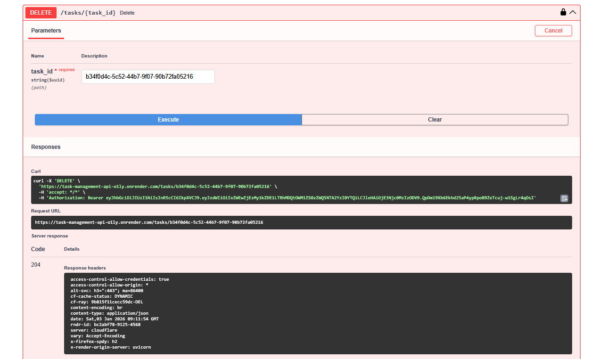

# Task Management System - Backend API

A production-ready FastAPI backend with JWT authentication, refresh token rotation, and role-based access control.

## 🔗 Live API

**Swagger Docs:** https://task-management-api-o1ly.onrender.com/docs

Test the API directly in your browser with interactive documentation!

## Features

- ✅ User registration and authentication
- ✅ JWT access & refresh tokens with rotation
- ✅ Secure token storage and revocation
- ✅ Role-based authorization (user/admin)
- ✅ Protected CRUD operations for tasks
- ✅ Pagination and filtering
- ✅ PostgreSQL database with Alembic migrations

## Setup

### Prerequisites

- Python 3.10+
- PostgreSQL 12+

### Installation

1. Clone the repository
2. Create a virtual environment:
   ```bash
   python -m venv venv
   source venv/bin/activate  # On Windows: venv\Scripts\activate
   ```

3. Install dependencies:
   ```bash
   pip install -r app/requirements.txt
   ```

4. Configure environment variables:
   ```bash
   cp .env.example .env
   ```
   
   Edit `.env` and update:
   - `DATABASE_URL` - Your PostgreSQL connection string
   - `SECRET_KEY` - Generate with: `openssl rand -hex 32`

5. Create the database:
   ```bash
   python create_db.py
   ```

6. Run migrations:
   ```bash
   alembic upgrade head
   ```

7. Start the server:
   ```bash
   uvicorn app.main:app --reload
   ```

## API Endpoints

### Authentication
- `POST /auth/register` - Register new user
- `POST /auth/login` - Login and get tokens
- `POST /auth/refresh` - Refresh access token
- `POST /auth/logout` - Revoke refresh token

### Tasks (Protected)
- `GET /tasks` - List tasks (with pagination & filtering)
- `POST /tasks` - Create task
- `PUT /tasks/{id}` - Update task
- `DELETE /tasks/{id}` - Delete task

### Query Parameters
- `limit` (1-100) - Results per page
- `offset` (0+) - Skip results
- `status` (todo/in_progress/done) - Filter by status

## Architecture

### Authentication & Authorization

**Access Token (JWT)**
- Short-lived (15 minutes)
- Stored client-side (memory/sessionStorage)
- Included in `Authorization: Bearer <token>` header
- Contains user ID in `sub` claim

**Refresh Token (JWT)**
- Long-lived (7 days)
- Includes unique token ID (`jti` claim)
- Hashed and stored in database
- Enables token rotation and revocation

**Token Rotation Flow**
1. Client requests refresh with refresh token
2. Server validates token and checks if revoked
3. Old token is immediately revoked
4. New access + refresh tokens issued
5. Old refresh token cannot be reused (401 error)

**Security Features**
- Reuse detection: Old tokens are revoked after use
- Database-backed revocation: Logout invalidates tokens
- Ownership enforcement: Users can only access their own data
- Role-based access control: Admin vs user permissions

### Database Schema

```
users
├── id (UUID, PK)
├── email (unique, indexed)
├── hashed_password
├── role (user | admin)
└── is_active

tasks
├── id (UUID, PK)
├── title
├── description
├── status (todo | in_progress | done)
├── owner_id (FK → users.id)
└── created_at (indexed with owner_id)

refresh_tokens
├── id (UUID, PK) -- matches jti claim
├── user_id (FK → users.id)
├── token_hash
├── expires_at
├── revoked
└── created_at
```

## Security

- Passwords hashed with bcrypt
- JWT tokens with expiration
- Refresh token rotation (prevents reuse)
- Database-backed token revocation
- Environment-based configuration

## Production Deployment

### Option 1: Render / Railway / Fly.io

1. **Set Environment Variables:**
   ```bash
   DATABASE_URL=<your-postgres-url>
   SECRET_KEY=<generate-with-openssl-rand-hex-32>
   ```

2. **Start Command:**
   ```bash
   gunicorn app.main:app --workers 4 --worker-class uvicorn.workers.UvicornWorker --bind 0.0.0.0:8000
   ```

3. **Run Migrations (on first deploy):**
   ```bash
   alembic upgrade head
   ```

### Option 2: Docker

```dockerfile
FROM python:3.11-slim

WORKDIR /app

COPY app/requirements.txt .
RUN pip install --no-cache-dir -r requirements.txt

COPY . .

CMD ["gunicorn", "app.main:app", "--workers", "4", "--worker-class", "uvicorn.workers.UvicornWorker", "--bind", "0.0.0.0:8000"]
```

### Production Checklist

✅ PostgreSQL database (managed service recommended)  
✅ Environment variables for all secrets  
✅ HTTPS enabled (platform default)  
✅ Run `alembic upgrade head` after deploy  
✅ Set strong `SECRET_KEY` (min 32 characters)  
✅ CORS configured if needed  
✅ Logs monitored  

### API Documentation

Once deployed, access interactive API docs at:
- **Swagger UI:** `https://your-domain.com/docs`
- **ReDoc:** `https://your-domain.com/redoc`

## Testing the API

### Quick Start with Swagger UI

1. **Visit the live Swagger docs:** https://task-management-api-o1ly.onrender.com/docs



### Step-by-Step Testing Flow

#### 1. Register a New User

Click on `POST /auth/register`, then "Try it out":

```bash
{
  "email": "test@example.com",
  "password": "securePass123",
  "name": "Test User"
}
```

**Response:**
```json
{
  "access_token": "eyJhbGciOiJIUzI1NiIsInR5cCI6IkpXVCJ9...",
  "refresh_token": "eyJhbGciOiJIUzI1NiIsInR5cCI6IkpXVCJ9...",
  "token_type": "bearer"
}
```



#### 2. Login (Get Tokens)

Use the **Authorize** button (green lock icon) in Swagger:
- **Username:** test@example.com (your email)
- **Password:** securePass123

Or use the login endpoint directly:

```bash
curl -X 'POST' \
  'https://task-management-api-o1ly.onrender.com/auth/login' \
  -H 'Content-Type: application/x-www-form-urlencoded' \
  -d 'username=test@example.com&password=securePass123'
```



#### 3. Authorize in Swagger

After login, click the **Authorize** button and Swagger will automatically attach your token to all requests.



#### 4. Create a Task

Now you can access protected endpoints! Create your first task:

```bash
{
  "title": "Complete API Testing",
  "description": "Test all CRUD operations",
  "status": "todo"
}
```

**Response:**
```json
{
  "id": "550e8400-e29b-41d4-a716-446xxxxxxxx",
  "title": "Complete API Testing",
  "description": "Test all CRUD operations",
  "status": "todo"
}
```



#### 5. Get All Tasks (Pagination)

List tasks with pagination:

```bash
curl -X 'GET' \
  'https://task-management-api-o1ly.onrender.com/tasks?limit=10&offset=0' \
  -H 'Authorization: Bearer YOUR_ACCESS_TOKEN'
```

**With status filter:**
```bash
curl -X 'GET' \
  'https://task-management-api-o1ly.onrender.com/tasks?limit=10&offset=0&status=todo' \
  -H 'Authorization: Bearer YOUR_ACCESS_TOKEN'
```



#### 6. Update a Task

Update task status:

```bash
curl -X 'PUT' \
  'https://task-management-api-o1ly.onrender.com/tasks/550e8400-e29b-41d4-a716-446655440000' \
  -H 'Authorization: Bearer YOUR_ACCESS_TOKEN' \
  -H 'Content-Type: application/json' \
  -d '{
  "status": "in_progress"
}'
```




#### 7. Refresh Token (Token Rotation)

When your access token expires (15 minutes), use the refresh token:

```bash
curl -X 'POST' \
  'https://task-management-api-o1ly.onrender.com/auth/refresh' \
  -H 'Content-Type: application/json' \
  -d '{
  "refresh_token": "YOUR_REFRESH_TOKEN"
}'
```

**Important:** The old refresh token is immediately revoked (can't be reused). You get new access + refresh tokens.



#### 8. Delete a Task

Delete a task by ID:

```bash
curl -X 'DELETE' \
  'https://task-management-api-o1ly.onrender.com/tasks/550e8400-e29b-41d4-a716-446655440000' \
  -H 'Authorization: Bearer YOUR_ACCESS_TOKEN'
```

**Response:** `204 No Content`



#### 9. Logout (Revoke Refresh Token)

Revoke your refresh token:

```bash
curl -X 'POST' \
  'https://task-management-api-o1ly.onrender.com/auth/logout' \
  -H 'Content-Type: application/json' \
  -d '{
  "refresh_token": "YOUR_REFRESH_TOKEN"
}'
```

**Response:** `204 No Content`


### Security Features Demonstrated

✅ **Token Rotation** - Refresh tokens can only be used once  
✅ **Ownership Enforcement** - Users can only access their own tasks  
✅ **Automatic Authorization** - Swagger Authorize button handles token management  
✅ **Pagination** - Limit results (1-100 per page)  
✅ **Filtering** - Filter tasks by status (todo/in_progress/done)  
✅ **Proper HTTP Status Codes** - 401 (Unauthorized), 403 (Forbidden), 404 (Not Found), 204 (No Content)

### Testing Checklist

- [ ] Register a new user
- [ ] Login and get tokens
- [ ] Create multiple tasks
- [ ] List tasks with pagination
- [ ] Filter tasks by status
- [ ] Update task status
- [ ] Try accessing another user's task (should get 404)
- [ ] Refresh access token
- [ ] Try reusing old refresh token (should get 401)
- [ ] Delete a task
- [ ] Logout and verify token is revoked

## Production Deployment

1. Set strong `SECRET_KEY` in production
2. Use managed PostgreSQL service
3. Enable HTTPS
4. Set appropriate token expiration times
5. Configure CORS if needed
6. Use environment variables for all secrets
7. Never commit `.env` file

## Development

Run tests:
```bash
python test_day4.py  # Task CRUD tests
python test_day5.py  # Auth & token rotation tests
```

## Project Structure

```
app/
├── api/
│   ├── dependencies.py    # Auth dependencies
│   └── routes/           # API endpoints
├── core/
│   ├── config.py         # Settings
│   └── security.py       # Auth utilities
├── db/
│   ├── base.py           # SQLAlchemy base
│   └── session.py        # Database session
├── models/               # Database models
├── schemas/              # Pydantic schemas
├── services/             # Business logic
└── main.py               # FastAPI app
```
